# Modelo de Previsão com Azure Machine Learning

## Tutorial Pages 
| Tutorial Pages                            | Best Model                            | 
| ----------------------------------- | ----------------------------------- |
| 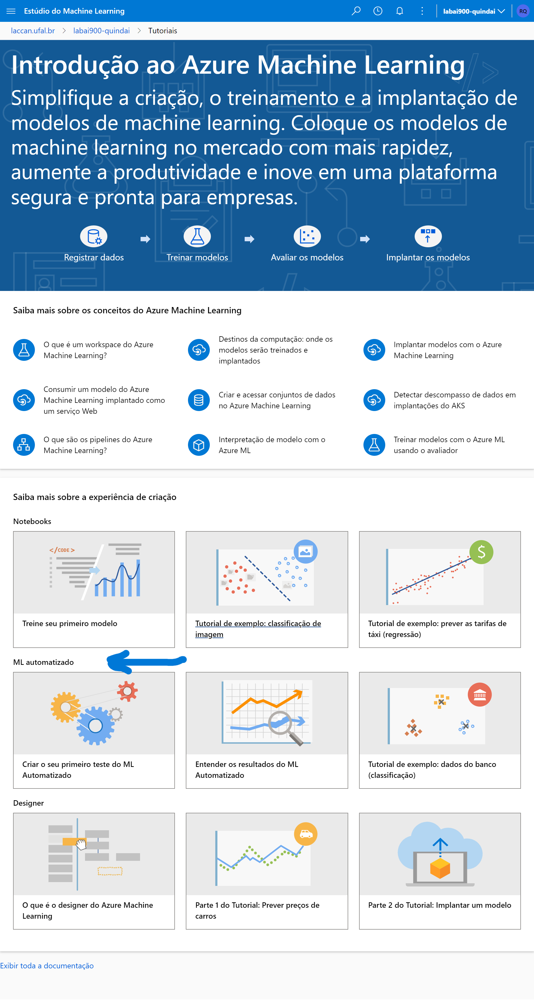 | 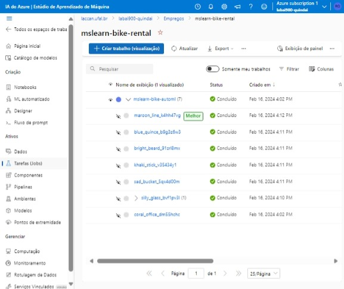 |

## Implantando o modelo em um ponto de extremidade

Dados em ponto de extremidade via REST que pode ser consumida temporariamente na URI REST http://c7226a4b-34e9-464b-99ed-606cd74bd866.eastus.azurecontainer.io/score
```json
{
  "Inputs": {
    "data": [
      {
        "day": 22,
        "mnth": 1,
        "year": 2012,
        "season": 1,
        "holiday": 0,
        "weekday": 0,
        "workingday": 0,
        "weathersit": 2,
        "temp": 0.163,
        "atemp": 0.162,
        "hum": 0.796,
        "windspeed": 0.2
      }
    ]
  },
  "GlobalParameters": 0.0
}
```

Resultado
```json
{
  "Results": [
    261.21536716527214
  ]
}
```

Para implantar esse modelo, basta seguir os passos abaixo:

## Melhor modelo encontrado pelo AutoML
Observe que as métricas do melhor modelo `maroon_line_k4hh47vg` algoritmo `MaxAbsScaler, LightGBM`, estão descritas abaixo e print da tela em seguida:
```
Variância explicada
0.77238
Erro absoluto de média
189.81
Erro de percentual absoluto de média
37.659
Erro mediano absoluto
112.35
Erro absoluto de média normalizado
0.055694
Erro mediano absoluto normalizado
0.032966
Erro de quadrado de média de raiz normalizado
0.092708
Erro de log de quadrado de média raiz normalizado
0.059429
Pontuação R2
0.77234
Erro de raiz do valor quadrático médio
315.95
Erro de log de raiz do valor quadrático médio
0.41815
Correlação de Spearman
0.91543
```
| Print das Métricas do melhor modelo                       
| ----------------------------------- |
| 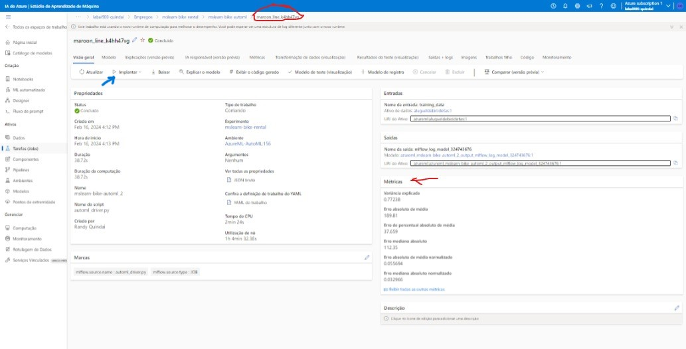 |

### Considerações sobre o RMSE - Erro Quadrático Médio Normalizado
Observe que dentre os 3 algoritmos, o que apresenta melhor RMSE é o `VotingEnsemble` com *92,71%* de RMSE.
Sendo um forte candidato para implantação num ponto de extremidade, como faremos a seguir.
| Print das Métricas do melhor modelo                       
| ----------------------------------- |
| 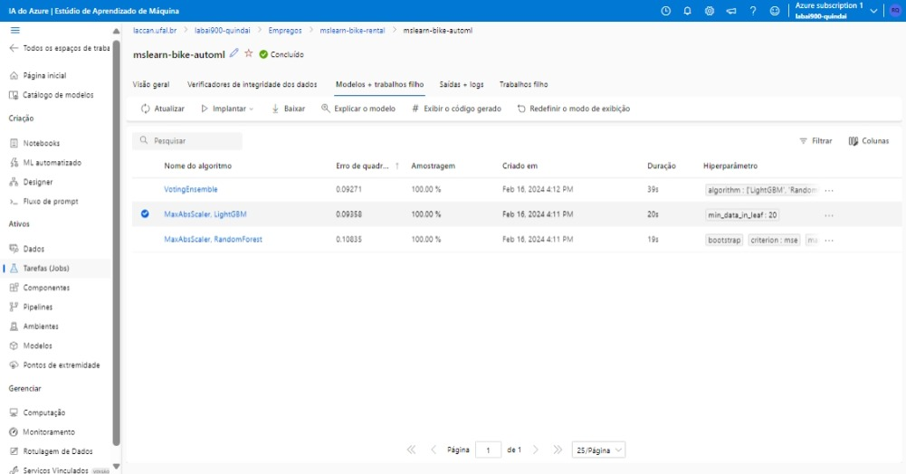 |

Para replicar os passos acima, usei as seguintes configurações do modelo:
> Com o modelo criado, você poderá visualizar essas configurações indo em `Tarefas (Jobs)` no menu lateral, e depois clicar em `mslearn-bike-automl`.
| Print das Métricas do melhor modelo                       
| ----------------------------------- |
| 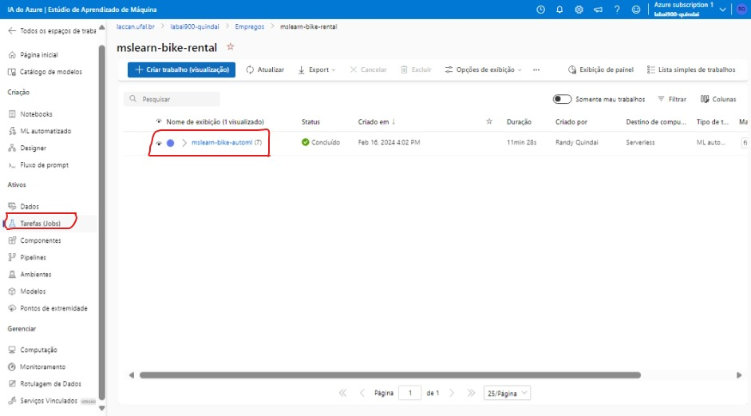 |

Siga os passos a seguir para replicar esse resultado e enviar um trabalho de treinamento no AutoML do Azure Machine Learning:
| Clica em Editar e enviar (visualização) |                      
| ----------------------------------- |
| 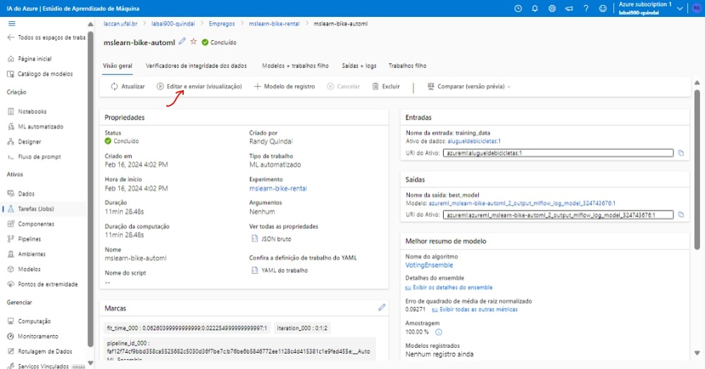 |

| Selecione a opção "Treinar Automaticamente" em "Método de Treinamento" |                      
| ----------------------------------- |
| 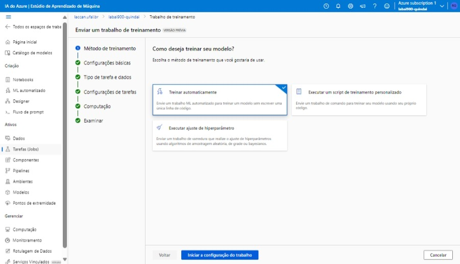 |

| Insira o nome do seu experimento em "Configurações Básicas". Usei o nome `mslearn-bike-rental`, todas as outras opções e Tags pode deixar em branco |                      
| ----------------------------------- |
| 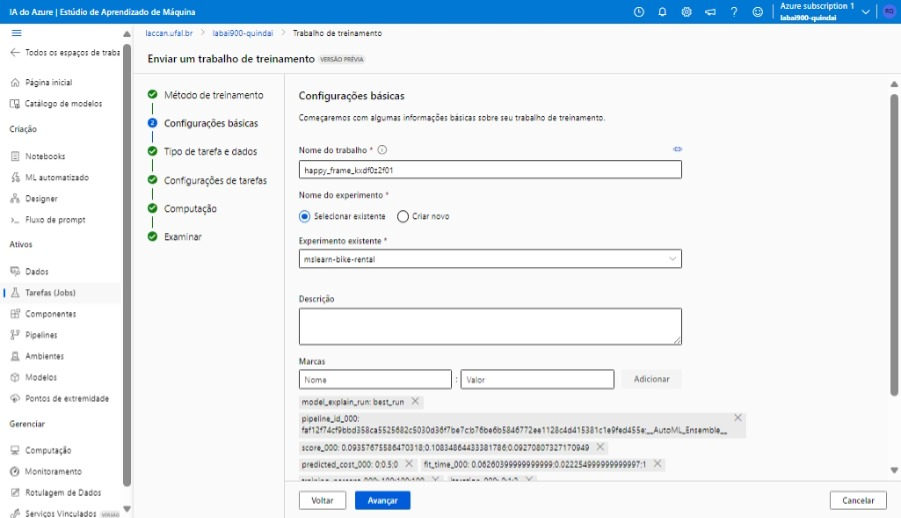 |

| Em "Tipo de tarefa e dados" selecione a opção "Regressão", dê o nome que achar mais conveniente aos seus dados |                      
| ----------------------------------- |
| 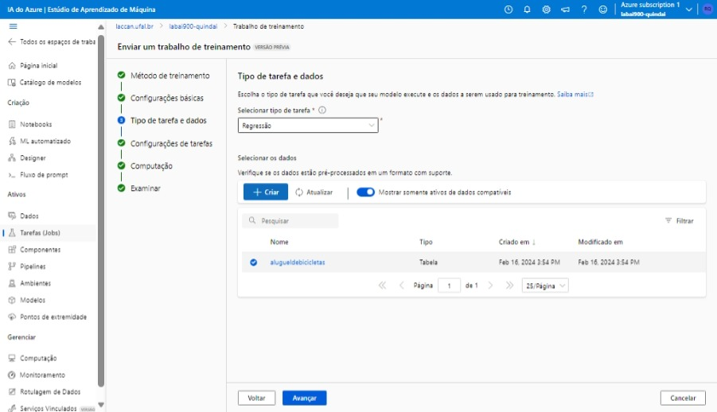 |

| Em "Configurações de tarefas" selecione a coluna destino como `rentals`, Validação de Percentual 10 | "Tipo de validação" escolha "Divisão de validação de treinamento"  |                      
| ----------------------------------- | ----------------------------------- |
| 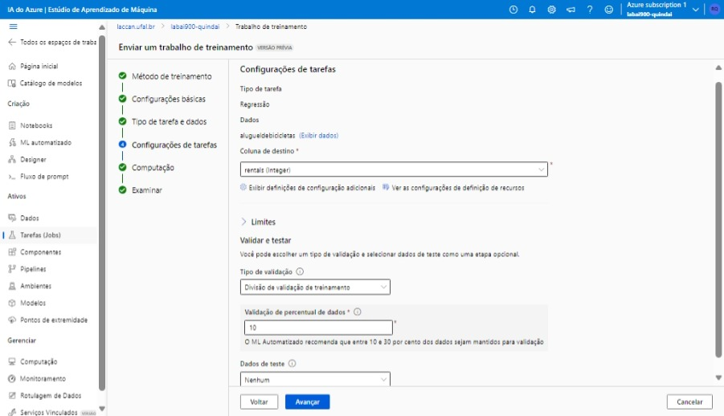 | 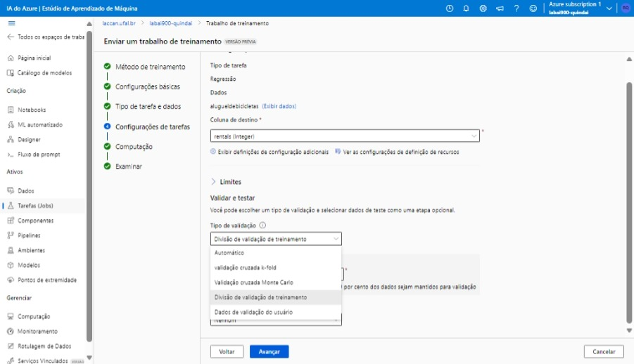 |

| Em "Computação" selecione a opção "Sem servidor" |                      
| ----------------------------------- |
| 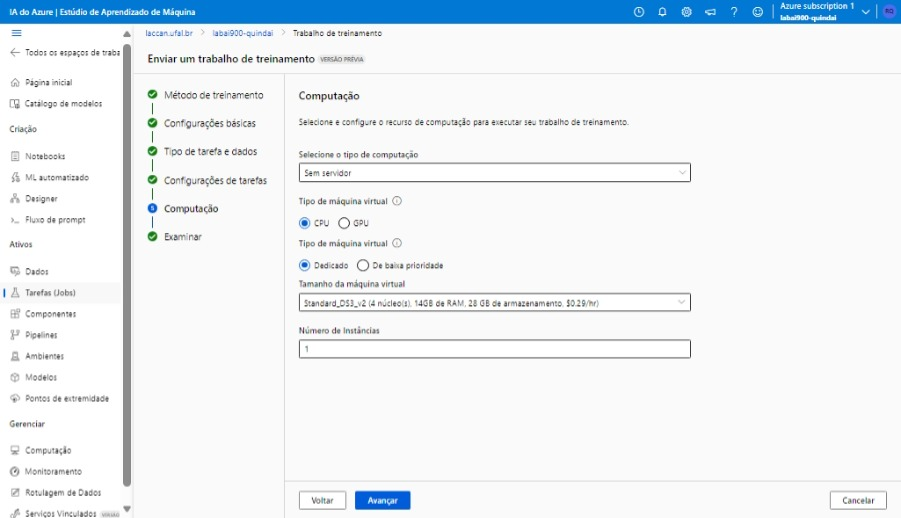 |

| Ao final, revise e avance para o treinamento, que poderá demorar entre 10 a 15 minutos |                      
| ----------------------------------- |
|  |


## Limpeza
Se você não quiser correr o risco de receber cobranças indesejadas, apague qualquer grupo de recursos após essa atividade, pois, já não são mais necessários.

Para isso, abra o portal da Azure https://portal.azure.com e selecione na opção grupo de recursos o grupo que contém os recursos que você criou.

Clica no recurso e selecione a opção Delete e depois confirme. O recurso será apagado.

## Links Importantes:
* https://microsoftlearning.github.io/mslearn-ai-fundamentals/Instructions/Labs/02-content-safety.html
* https://microsoftlearning.github.io/mslearn-ai-fundamentals/Instructions/Labs/01-machine-learning.html
* https://learn.microsoft.com/pt-br/azure/machine-learning/how-to-use-automated-ml-for-ml-models?view=azureml-api-2
* https://learn.microsoft.com/pt-br/azure/machine-learning/tutorial-first-experiment-automated-ml?view=azureml-api-2
* https://learn.microsoft.com/pt-br/azure/machine-learning/concept-endpoints?view=azureml-api-2
